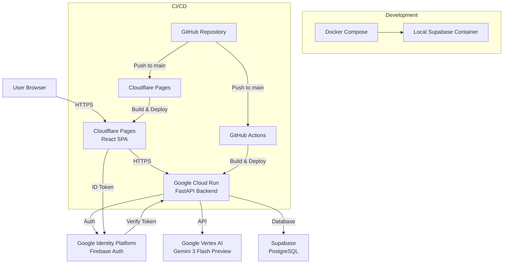
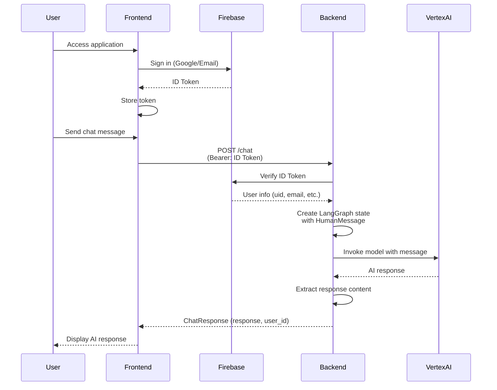

# Architecture

## System Overview

Hit8 is an AI-powered chat application that provides conversational interactions through Google Vertex AI. The system consists of a React-based frontend, a FastAPI backend with LangGraph orchestration, and integrates with Google Identity Platform for authentication and Supabase for data storage.

## Architecture Diagram

## Component Breakdown

### Backend

The backend is a **FastAPI** application that serves as the API layer for the chat system.

**Key Components:**
- **FastAPI Application** ([`backend/app/main.py`](backend/app/main.py)): Main application entrypoint with CORS middleware and route handlers
- **LangGraph Orchestration** ([`backend/app/graph.py`](backend/app/graph.py)): State machine for managing chat conversation flow
- **Configuration Management** ([`backend/app/config.py`](backend/app/config.py)): Pydantic-based settings with YAML and environment variable support
- **Authentication** ([`backend/app/deps.py`](backend/app/deps.py)): Google Identity Platform token verification using Firebase Admin SDK

**Technology Stack:**
- Python 3.11+
- FastAPI 0.127.0+
- LangGraph 1.0.5+
- LangChain Core 1.2.5+
- LangChain Google GenAI 4.1.2+
- Firebase Admin SDK 7.1.0+
- Pydantic Settings 2.12.0+

### Frontend

The frontend is a **React + TypeScript** Single Page Application (SPA).

**Key Components:**
- **Main App** ([`frontend/src/App.tsx`](frontend/src/App.tsx)): Authentication flow and routing
- **Chat Interface** ([`frontend/src/components/ChatInterface.tsx`](frontend/src/components/ChatInterface.tsx)): Chat UI component
- **UI Components**: Tailwind CSS-based component library

**Technology Stack:**
- React 18.2.0+
- TypeScript 5.3.3+
- Vite 5.0.11+
- Firebase SDK 12.7.0+
- Tailwind CSS 3.4.1+
- Axios 1.6.5+

### AI/LLM

**Google Vertex AI** is used for generating chat responses:
- Model: `gemini-3-flash-preview`
- Location: `global`
- Provider: Vertex AI (not direct API)
- Authentication: Service account credentials

### Database

**Supabase** provides PostgreSQL database services:
- Production: Cloud-hosted Supabase instance
- Development: Local PostgreSQL container via Docker Compose
- Client: Supabase Python client library

### Authentication

**Google Identity Platform** (Firebase Auth) handles user authentication:
- Frontend: Firebase Auth SDK for sign-in (Google OAuth and email/password)
- Backend: Firebase Admin SDK for token verification
- Token Flow: ID tokens are generated on the frontend and verified on the backend

## Data Flow

## Technology Stack Summary

### Backend
- **Runtime**: Python 3.11+
- **Framework**: FastAPI
- **AI Orchestration**: LangGraph
- **LLM Integration**: LangChain Google GenAI
- **Authentication**: Firebase Admin SDK
- **Configuration**: Pydantic Settings + YAML
- **Package Management**: uv (via pyproject.toml)
- **Testing**: pytest, pytest-asyncio, httpx

### Frontend
- **Runtime**: Node.js 20+
- **Framework**: React 18.2+
- **Language**: TypeScript 5.3+
- **Build Tool**: Vite 5.0+
- **Authentication**: Firebase SDK
- **HTTP Client**: Axios
- **Styling**: Tailwind CSS
- **Package Management**: npm

### Infrastructure
- **Backend Hosting**: Google Cloud Run
- **Frontend Hosting**: Cloudflare Pages
- **Database**: Supabase (PostgreSQL)
- **Container Registry**: Google Container Registry (GCR)
- **Secrets Management**: Doppler (via GCP Secret Manager in production)
- **CI/CD**: GitHub Actions (backend), Cloudflare Pages (frontend)

