# Architecture Overview

## System Overview

Hit8 is an AI-powered conversational application built with LangGraph orchestration, providing multi-tenant chat capabilities with real-time streaming, graph visualization, and observability.

**Core Components:**

- React TypeScript frontend (Cloudflare Pages)
- FastAPI Python backend (GCP Cloud Run)
- LangGraph state machine for agent orchestration
- PostgreSQL (Supabase) for persistence
- Google Vertex AI for LLM inference

## High-Level Architecture

### Component Diagram

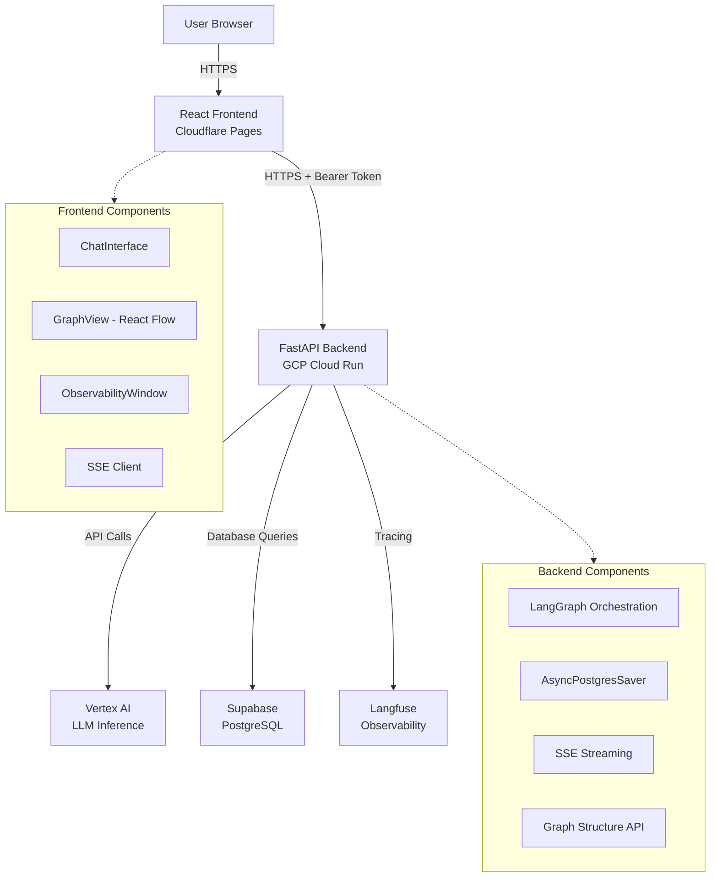

### Request Flow

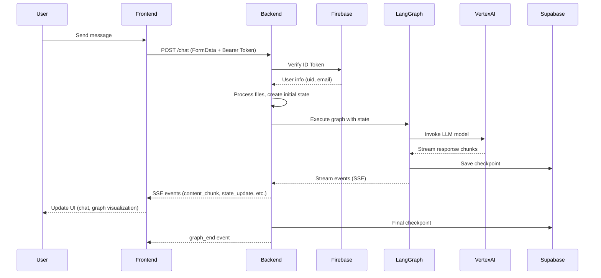

## Key Design Decisions

### 1. Multi-Tenant Architecture

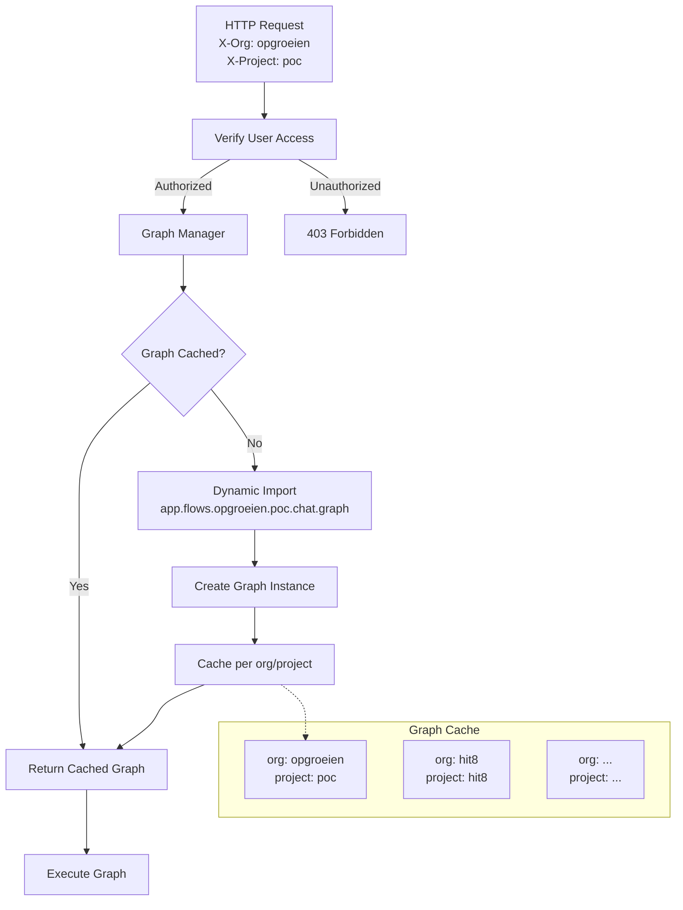

**Key Features:**

- **Org/Project routing**: Headers (`X-Org`, `X-Project`) determine which graph implementation to use
- **Dynamic graph loading**: Graphs loaded from `app.flows.{org}.{project}.{flow}.graph` module path
- **Thread-safe caching**: Graphs cached per org/project combination with lazy initialization
- **User access control**: Validates user access to org/project via `user_config.json`

### 2. LangGraph State Machine

- **State-based orchestration**: TypedDict state with message history
- **Conditional routing**: Agent node routes to tool nodes based on tool calls
- **Tool execution**: Each tool has dedicated node; tools execute sequentially
- **Checkpointing**: AsyncPostgresSaver persists state after each node execution
- **Thread continuity**: State restored from checkpoints using `thread_id` in config

### 3. Pure Async Streaming

- **Event loop native**: Uses `astream_events()` directly in FastAPI event loop (no threads)
- **SSE protocol**: Server-Sent Events for real-time updates to frontend
- **Event types**: `graph_start`, `content_chunk`, `node_start/end`, `state_update`, `tool_start/end`, `llm_start/end`, `graph_end`
- **Accumulated content**: Tracks incremental content chunks for streaming display

### 4. Graph Visualization

- **Structure API**: `/graph/structure` endpoint returns nodes/edges as JSON
- **React Flow**: Frontend renders graph structure with React Flow library
- **Real-time highlighting**: Execution state updates highlight active/visited nodes
- **State API**: `/graph/state` endpoint retrieves checkpointed state for thread restoration

### 5. Observability

- **In-memory metrics**: Tracks LLM calls, embeddings, Bright Data usage per execution
- **TTFT tracking**: Time-to-first-token measured via stream event hooks
- **Polling API**: Frontend polls `/observability/metrics` for real-time metrics display
- **Langfuse integration**: Optional tracing via Langfuse callback handlers

### 6. Cloud Run Deployment

- **VPC egress**: All traffic routed through VPC with static NAT IP
- **Connection pooling**: Shared asyncpg connection pool for PostgreSQL
- **Lifespan management**: FastAPI lifespan initializes pool/checkpointer at startup
- **Secrets injection**: Doppler secrets loaded from GCP Secret Manager
- **Auto-scaling**: Min 0, max 10 instances with container concurrency 160

## LangGraph Usage and Viewer

### Graph Structure

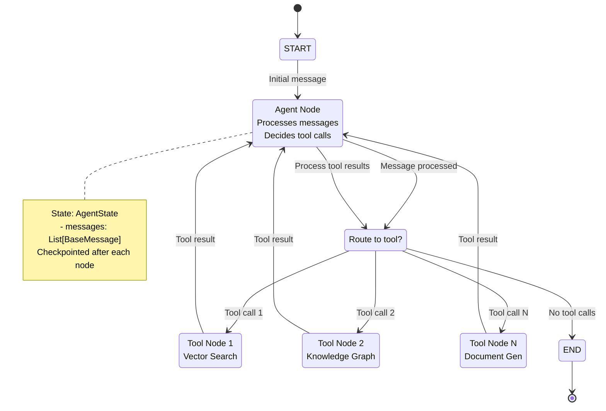

**Node Types:**

- **Agent Node**: Processes messages, decides tool calls, routes to tools
- **Tool Nodes**: Execute specific tools (vector search, knowledge graph, document generation, etc.)
- **Routing Logic**: Conditional edges from agent to tool nodes based on pending tool calls

**State Management:**

- **TypedDict State**: `AgentState` with `messages` list (annotated with `operator.add` for merging)
- **Checkpointing**: AsyncPostgresSaver stores state after each node execution
- **Thread ID**: Unique identifier per conversation thread, used for state restoration

**Graph Compilation:**

- Graphs compiled with checkpointer at application startup
- Checkpointer initialized once via FastAPI lifespan
- Graph instances cached per org/project combination

### Graph Viewer Integration

**Frontend Components:**

- **GraphView**: React Flow visualization of graph structure
- **StatusWindow**: Shows execution state (visited nodes, active node, message count)
- **Real-time Updates**: Execution state pushed via SSE `state_update` events

**Backend APIs:**

- **GET /graph/structure**: Returns graph nodes/edges as JSON
- **GET /graph/state**: Retrieves checkpointed state for thread_id
- **Streaming events**: `state_update` events include `next`, `visited_nodes`, `message_count`

## Frontend-Backend Integration

### Authentication Flow

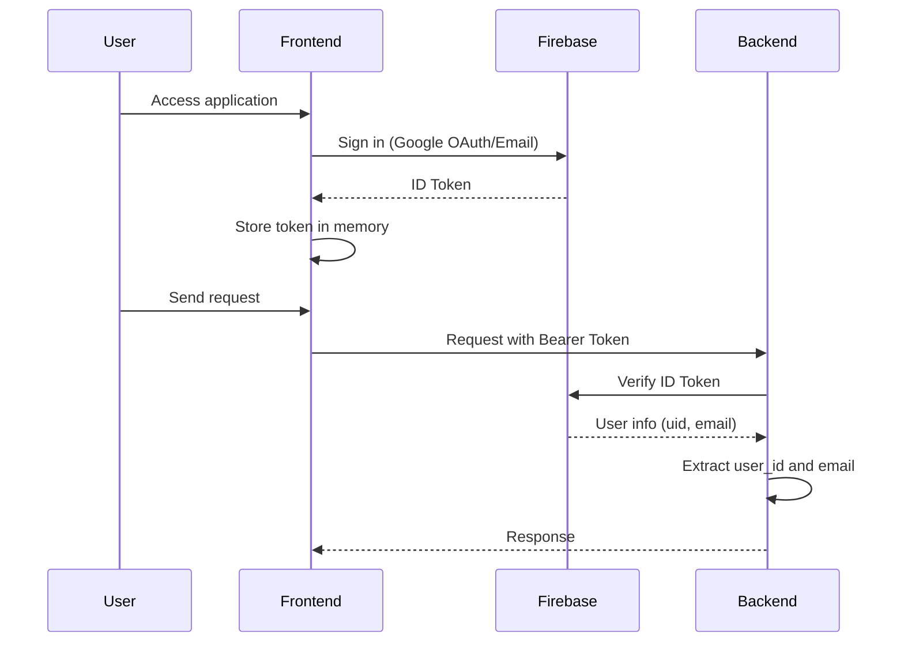

### Chat Flow

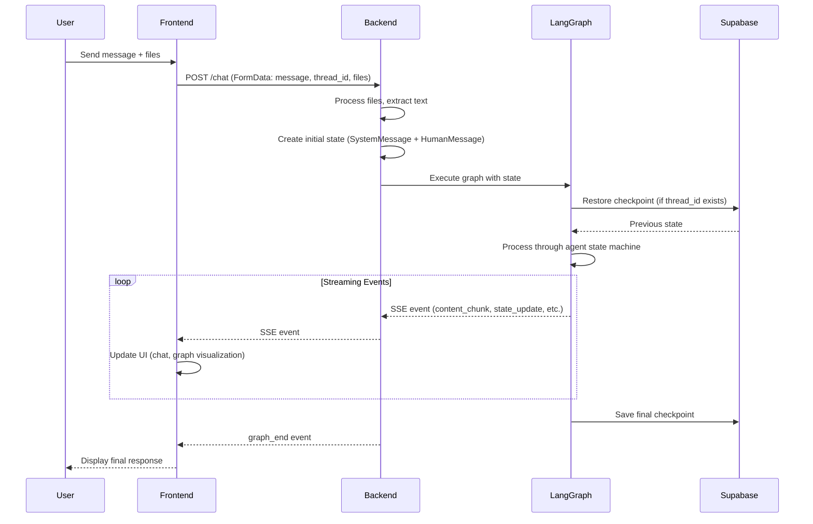

### Event Types

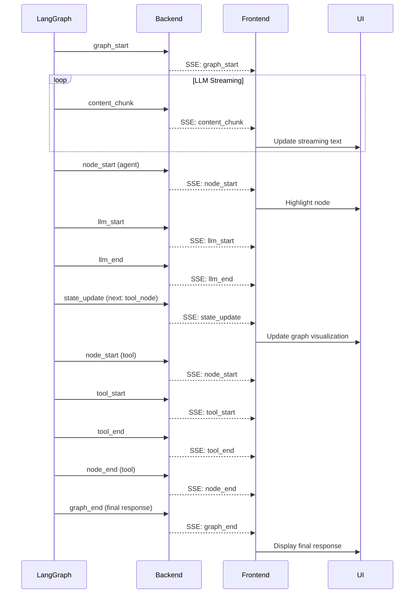

**Event Types:**

- `graph_start`: Execution begins
- `content_chunk`: Incremental AI response text
- `node_start/end`: Graph node execution lifecycle
- `state_update`: Current execution state (next nodes, visited nodes, message count)
- `tool_start/end`: Tool execution events
- `llm_start/end`: LLM call lifecycle
- `graph_end`: Execution complete with final response
- `error`: Error event with details

### State Synchronization

- **Thread-based**: Each conversation uses unique `thread_id` (UUID)
- **Checkpointing**: State persisted after each node execution
- **Restoration**: Frontend fetches state on thread_id change to restore conversation history
- **Real-time**: SSE events provide live execution updates

## GCP Cloud Run Usage

### Infrastructure Components

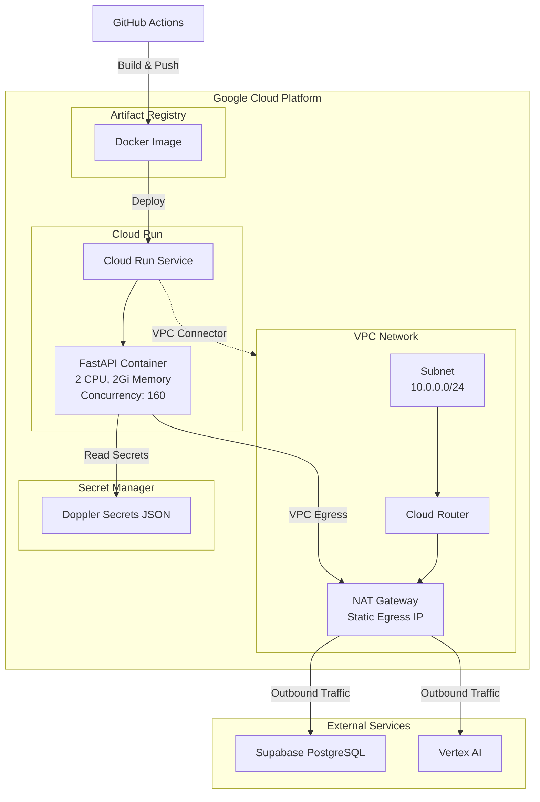

**VPC Configuration:**

- Custom VPC with subnet (10.0.0.0/24)
- Cloud Router with NAT Gateway
- Static egress IP for outbound traffic
- VPC connector for Cloud Run service

**Cloud Run Service:**

- **Image**: Docker image from Artifact Registry
- **Resources**: 2 CPU, 2Gi memory
- **Scaling**: Min 0, max 10 instances
- **Concurrency**: 160 requests per instance
- **Timeout**: 300 seconds
- **Network**: VPC egress for all traffic

**Secrets Management:**

- Doppler secrets stored in GCP Secret Manager
- Secrets injected as `DOPPLER_SECRETS_JSON` environment variable
- Backend parses JSON and loads into environment at startup

**Database:**

- Supabase PostgreSQL (cloud-hosted)
- Connection pooling via asyncpg
- SSL connection with root certificate
- AsyncPostgresSaver uses shared connection pool

### Deployment Flow

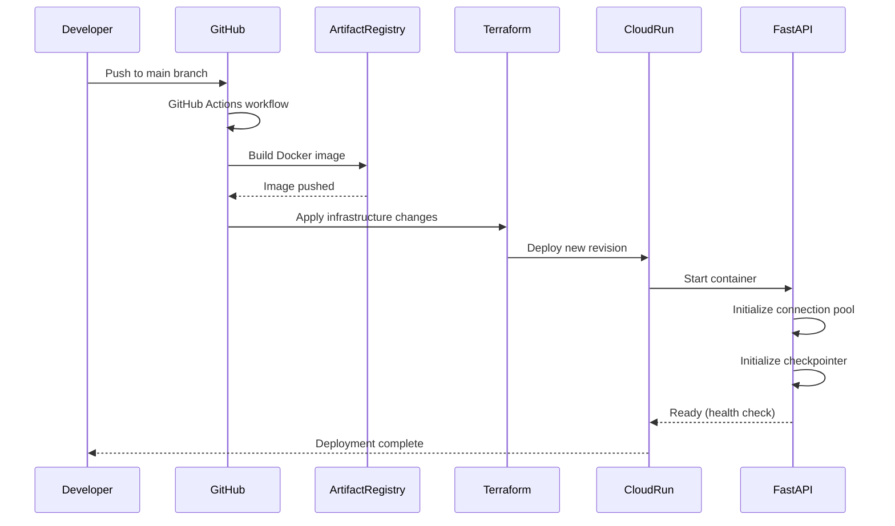

### Key Cloud Run Features

- **Cold starts**: Startup CPU boost enabled for faster initialization
- **Auto-scaling**: Scales to zero when idle, up to 3 instances under load
- **VPC egress**: All outbound traffic (Vertex AI, Supabase) routes through VPC
- **IAM**: Unauthenticated access allowed (auth handled at application level)

## Data Flow

### Chat Execution Flow

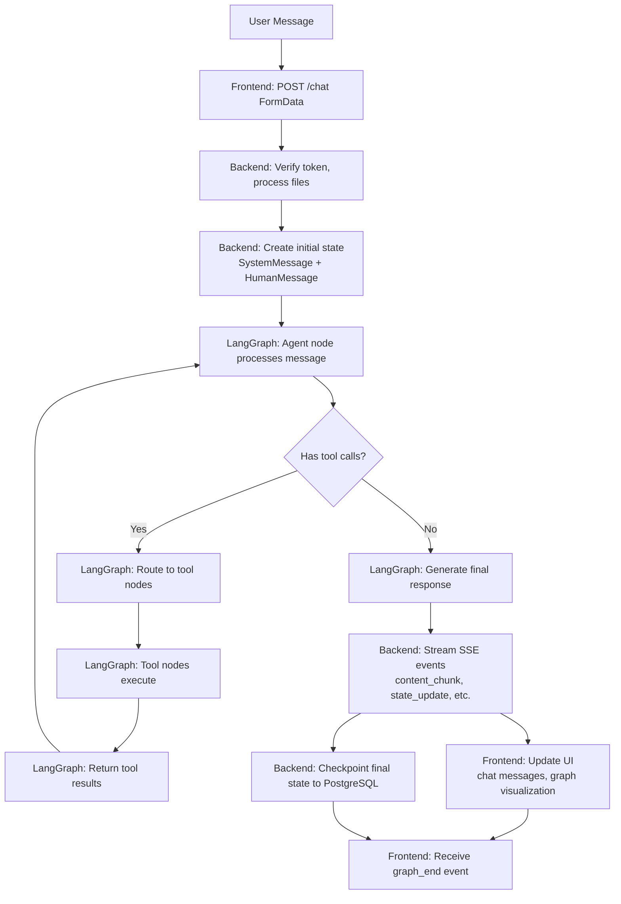

### State Persistence Flow

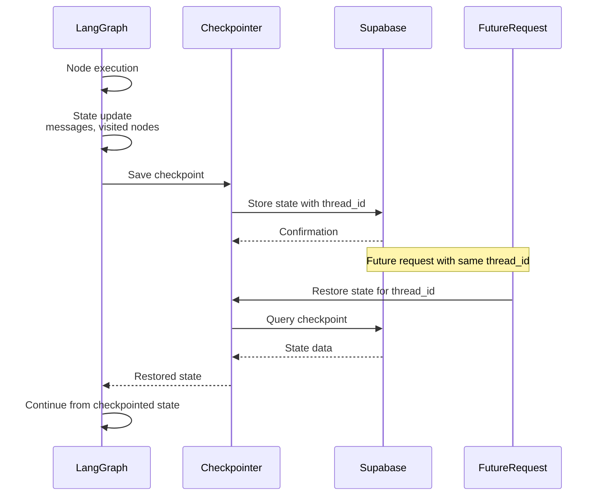

## Component Structure

### Backend Module Dependencies

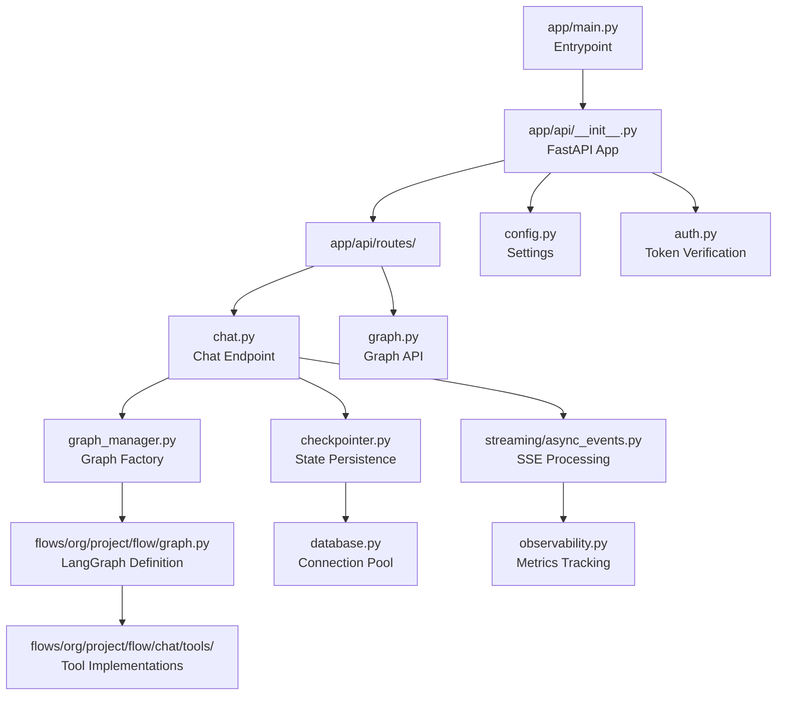

### Frontend Module Dependencies

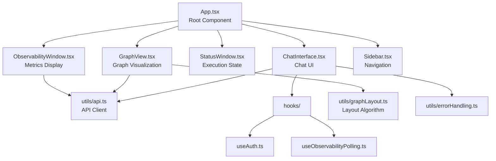

### Backend Modules

- **`app/main.py`**: Application entrypoint, FastAPI app creation
- **`app/api/__init__.py`**: FastAPI app with lifespan, middleware, routes
- **`app/api/routes/chat.py`**: Chat endpoint with streaming
- **`app/api/routes/graph.py`**: Graph structure/state endpoints
- **`app/api/graph_manager.py`**: Thread-safe graph initialization/caching
- **`app/api/checkpointer.py`**: AsyncPostgresSaver management
- **`app/api/streaming/async_events.py`**: SSE event processing
- **`app/flows/{org}/{project}/{flow}/graph.py`**: LangGraph definition
- **`app/flows/{org}/{project}/{flow}/chat/tools/`**: Tool implementations

### Frontend Modules

- **`App.tsx`**: Root component with routing, auth, layout
- **`ChatInterface.tsx`**: Chat UI with SSE consumption
- **`GraphView.tsx`**: React Flow graph visualization
- **`StatusWindow.tsx`**: Execution state display
- **`ObservabilityWindow.tsx`**: Metrics polling and display
- **`utils/api.ts`**: API client with auth headers

## Additional Topics

### Error Handling

- Structured error responses with error types
- SSE error events for streaming failures
- Error boundary in React frontend
- Sentry integration for error tracking

### File Processing

- Supports multiple formats (docx, xlsx, pdf, etc.)
- Text extraction via document processing utilities
- Content appended to message before graph execution

### Thread Management

- Thread titles generated from first message
- Thread tracking in database (upsert on access)
- Thread history restoration from checkpoints

### Observability Metrics

- LLM usage (tokens, duration, TTFT)
- Embedding usage
- Bright Data usage (cost tracking)
- Per-execution and aggregated metrics
