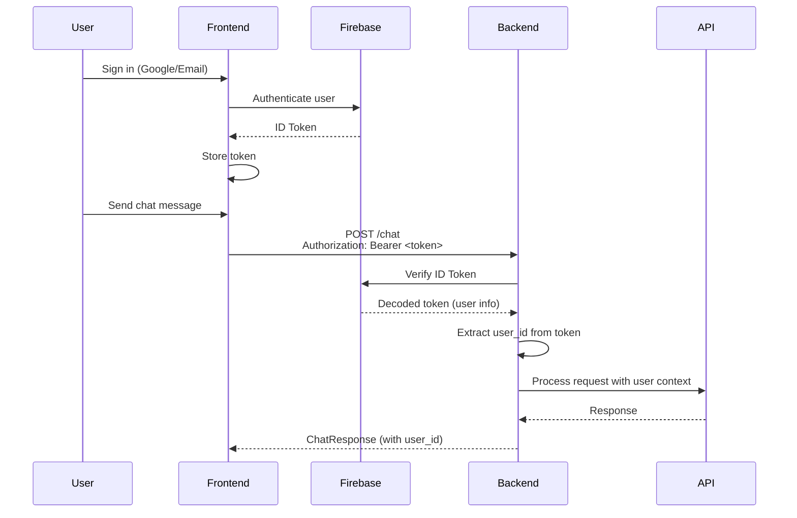

# Authentication

## Authentication Flow

Hit8 uses **Google Identity Platform** (Firebase Auth) for user authentication. The system supports both Google Sign-In and email/password authentication.

## Frontend Authentication

The frontend handles user authentication using the Firebase Auth SDK.

### Implementation

**File**: [`frontend/src/App.tsx`](frontend/src/App.tsx)

**Key Features:**
- Google Sign-In via OAuth popup
- Email/password authentication
- Automatic token refresh
- Persistent authentication state

### Authentication Methods

#### Google Sign-In

```typescript
const handleLogin = async () => {
  const auth = getAuth(firebaseApp!)
  const provider = new GoogleAuthProvider()
  provider.setCustomParameters({ prompt: 'select_account' })
  await signInWithPopup(auth, provider)
}
```

**Features:**
- OAuth popup flow
- Account selection prompt
- Automatic token generation

#### Email/Password Authentication

```typescript
// Sign up
await createUserWithEmailAndPassword(auth, email, password)

// Sign in
await signInWithEmailAndPassword(auth, email, password)
```

**Features:**
- User registration
- Email/password login
- Error handling for restricted sign-ups

### Token Management

**ID Token Generation:**
```typescript
const token = await firebaseUser.getIdToken(false)
```

**Token Storage:**
- Stored in React state
- Automatically refreshed when expired
- Sent with API requests as Bearer token

**Token Usage:**
- Included in `Authorization` header for API requests
- Format: `Bearer <id_token>`

## Backend Authentication

The backend verifies ID tokens using the Firebase Admin SDK.

### Implementation

**File**: [`backend/app/deps.py`](backend/app/deps.py)

**Key Components:**
- Firebase Admin SDK initialization
- Token verification dependency
- User information extraction

### Token Verification

**Dependency Function:**
```python
async def verify_google_token(
    credentials: HTTPAuthorizationCredentials = Depends(security)
) -> dict:
    """Verify Google Identity Platform ID token and return user info."""
    decoded_token = auth.verify_id_token(credentials.credentials)
    return {
        'sub': decoded_token['uid'],
        'email': decoded_token.get('email', ''),
        'name': decoded_token.get('name', ''),
        'picture': decoded_token.get('picture', ''),
    }
```

**Process:**
1. Extract Bearer token from `Authorization` header
2. Verify token with Firebase Admin SDK
3. Decode token to get user information
4. Return user payload (uid, email, name, picture)

### Firebase Admin Initialization

**Setup:**
```python
service_account_info = json.loads(settings.vertex_service_account_json)
cred = credentials.Certificate(service_account_info)
firebase_admin.initialize_app(cred, {'projectId': settings.gcp_project})
```

**Configuration:**
- Uses service account credentials from settings
- Initialized once at application startup
- Skipped during tests (mocked)

## Token Flow



## Implementation Details

### Frontend: App.tsx

**Authentication State:**
```typescript
const [user, setUser] = useState<IdentityUser | null>(null)
const [idToken, setIdToken] = useState<string | null>(null)
```

**Auth State Listener:**
```typescript
onAuthStateChanged(auth, async (firebaseUser: User | null) => {
  if (firebaseUser) {
    const token = await firebaseUser.getIdToken(false)
    setIdToken(token)
    setUser({
      id: firebaseUser.uid,
      email: firebaseUser.email || '',
      name: firebaseUser.displayName || '',
      picture: firebaseUser.photoURL || '',
    })
  } else {
    setUser(null)
    setIdToken(null)
  }
})
```

**API Request with Token:**
```typescript
const response = await axios.post(
  `${API_URL}/chat`,
  { message: userMessage.content },
  {
    headers: {
      Authorization: `Bearer ${token}`,
      'Content-Type': 'application/json',
    },
  }
)
```

### Backend: deps.py

**HTTPBearer Security:**
```python
security = HTTPBearer()
```

**Token Verification Dependency:**
```python
@app.post("/chat", response_model=ChatResponse)
async def chat(
    request: ChatRequest,
    user_payload: dict = Depends(verify_google_token)
):
    user_id = user_payload["sub"]
    # ... process chat request
```

**Error Handling:**
- Invalid token: Returns 401 Unauthorized
- Missing token: Returns 401 Unauthorized
- Expired token: Returns 401 Unauthorized

## Google Identity Platform Configuration

### Required Configuration

**Frontend (Firebase Config):**
- `apiKey`: Firebase API key
- `authDomain`: Firebase Auth domain
- `projectId`: Google Cloud Project ID

**Backend (Service Account):**
- Service account JSON: Contains credentials for Firebase Admin SDK
- Project ID: Google Cloud Project ID

### Environment Variables

**Frontend:**
- `VITE_GOOGLE_IDENTITY_PLATFORM_KEY`: Firebase API key
- `VITE_GOOGLE_IDENTITY_PLATFORM_DOMAIN`: Firebase Auth domain
- `VITE_GCP_PROJECT`: Google Cloud Project ID

**Backend:**
- `GOOGLE_IDENTITY_PLATFORM_DOMAIN`: Firebase Auth domain
- `GCP_PROJECT`: Google Cloud Project ID
- `VERTEX_HIT8_POC_IAM_GSERVICEACCOUNT_COM`: Service account JSON

## Security

### Token Validation

**Frontend:**
- Tokens automatically refreshed by Firebase SDK
- Tokens stored in memory (not localStorage for security)
- Token expiration handled automatically

**Backend:**
- Tokens verified on every request
- Invalid tokens rejected immediately
- Token signature validated by Firebase Admin SDK

### User Identification

**User ID Extraction:**
- User ID (`sub`/`uid`) extracted from verified token
- Used for request logging and user context
- Included in API responses

**User Information:**
- Email: From token claims
- Name: From token claims
- Picture: From token claims (if available)

### CORS Setup

**Configuration:**
- CORS enabled for frontend origins
- Credentials allowed (for cookies, if used)
- All methods and headers allowed

**Production Origins:**
- `https://www.hit8.io`
- `https://hit8.io`
- `https://hit8.pages.dev`

**Development Origins:**
- `http://localhost:5173`
- `http://127.0.0.1:5173`

### Security Best Practices

1. **Token Storage**: Tokens stored in memory, not persisted
2. **HTTPS Only**: All production traffic over HTTPS
3. **Token Verification**: Every API request verified
4. **CORS Restrictions**: Only allowed origins can access API
5. **Service Account Security**: Service account credentials stored securely in secrets

## Testing Authentication

**Mocking in Tests:**
- Firebase Admin SDK mocked in test configuration
- Token verification bypassed via dependency overrides
- See [Testing documentation](testing.md) for details

**Example Test Override:**
```python
async def mock_verify_token():
    return {"sub": "test_user_123"}

app.dependency_overrides[verify_google_token] = mock_verify_token
```

